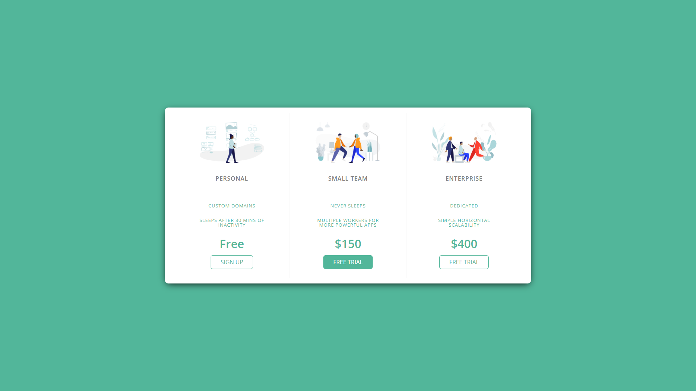
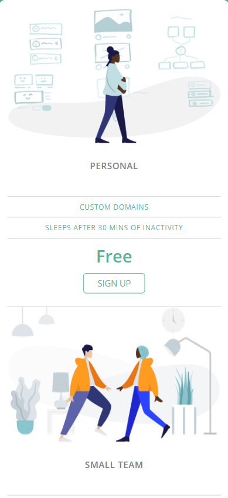

# Frontend Mentor - Social links profile solution

This is a simple pricing panel project from the Udemy course made in HTML and CSS.

## Table of contents

- [Overview](#overview)
  - [Screenshot](#screenshot)
  - [Links](#links)
- [My process](#my-process)
  - [Built with](#built-with)
- [Author](#author)

## Overview

### Screenshot

### Links

- Solution URL: [Add solution URL here](https://github.com/KKajet/ft-social-links-profile)
- Live Site URL: [Add live site URL here](https://kkajet.github.io/ft-social-links-profile/)

## My process

### Built with

- Semantic HTML5 markup
- BEM methodology
- CSS custom properties
- Flexbox
- Mobile-first workflow
- Visual Studio Code

## Author

- Frontend Mentor - [KKajet](https://www.frontendmentor.io/profile/KKajet)
